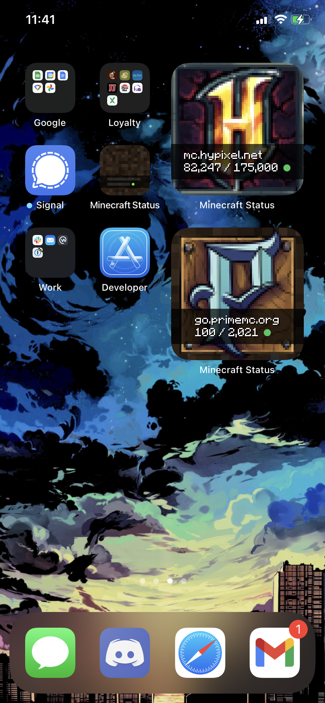

# minecraft-status

An iOS app with widgets that display the results of pinging a Minecraft server.

Built on top of the [mcping](https://github.com/Scetch/mcping) crate.

## Screenshots



## Building

Make sure you have [Rust](https://www.rust-lang.org/) installed, then:

```
cargo install cbindgen
```

and:

```
rustup target add aarch64-apple-ios x86_64-apple-ios
```

After which you can open the XCode project and click the build and run button. The details of generating / building the various Rust components are handled by a run script within the XCode project (`McpingWidgetViewExtension > Build Phases > Run Script`, executes the script at `swift/generate-rust-lib.sh`).

If you're running Big Sur you may need to perform the workaround described in [this comment](https://github.com/TimNN/cargo-lipo/issues/41#issuecomment-745623541) before building.
